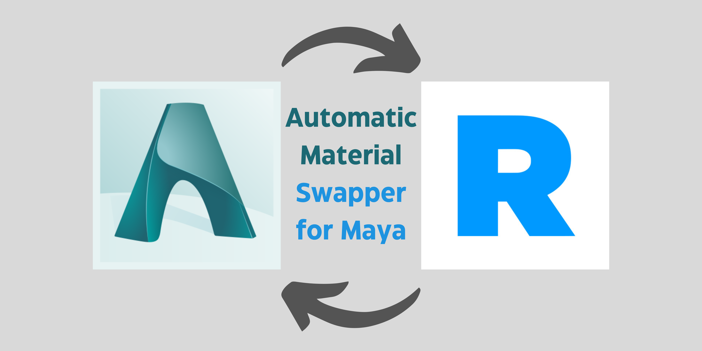
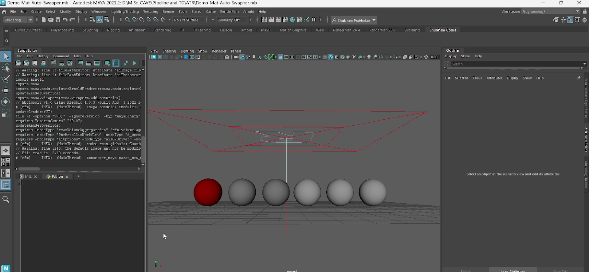
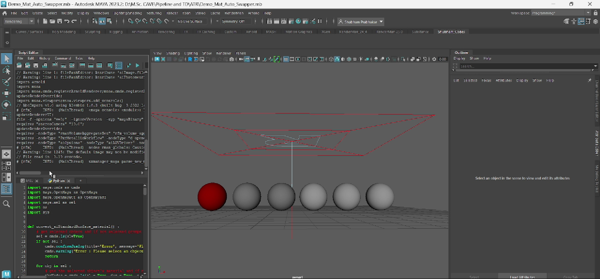
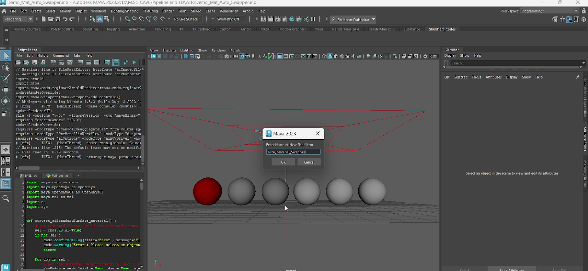
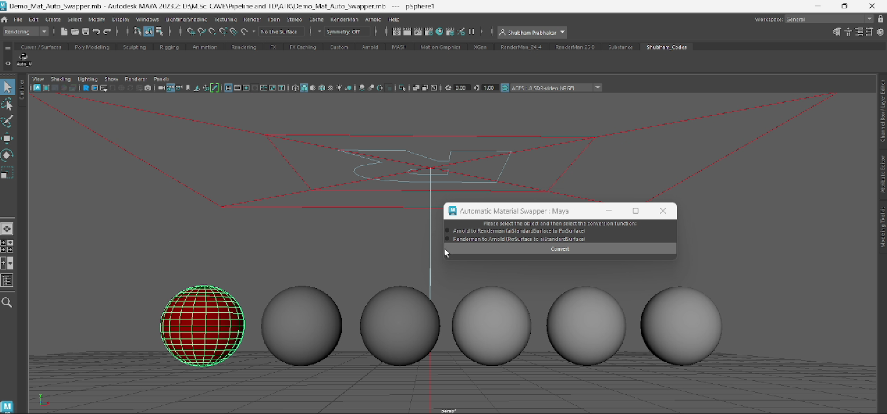
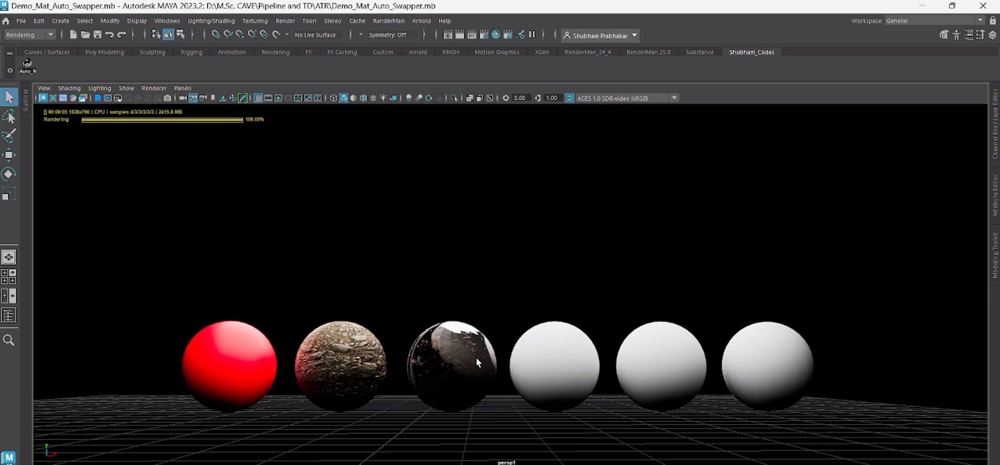
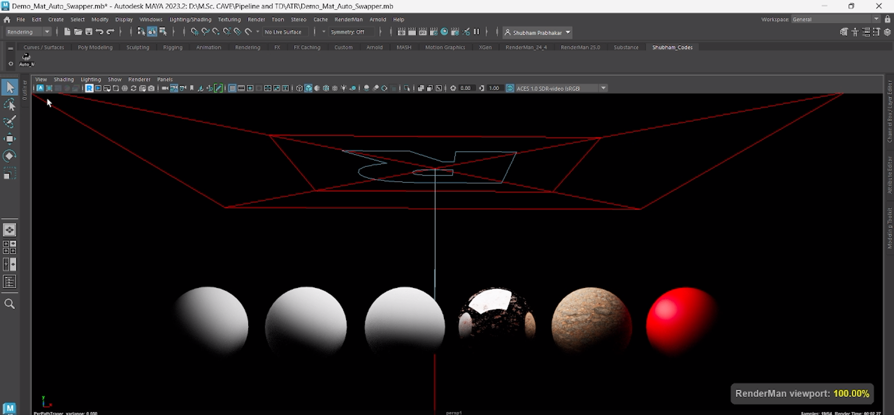
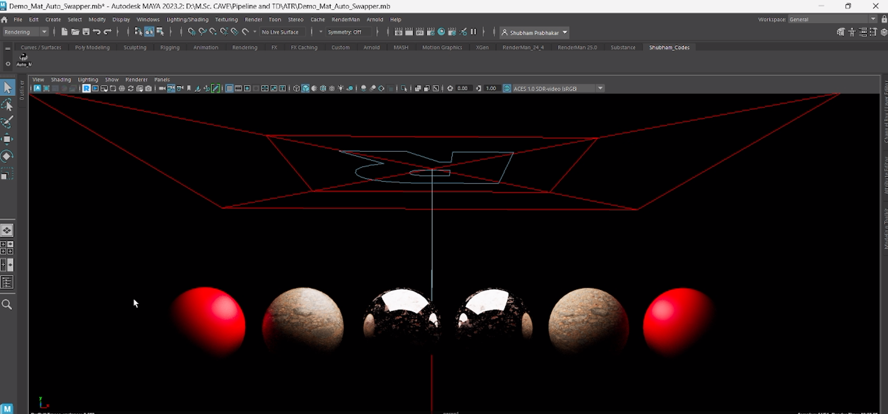

# Automatic Material Swapper for Maya
## version 1.0

This tool can be used to automatically swap between Arnold and Renderman materials in Maya.  

  

Supported materials in both the render engines: 
(After discussing with multiple M.A. 3D and M.A. Digital Effects students, I got to know these two are the most used materials in both the renderers)
* Arnold - aiStandardSurface
* Renderman - PxrSurface

## Installation
* Copy the code from Material_Swapper.py         
 
 

* Create a shelf button in Maya and paste the above copied code. 
  

## How to use
1. Open a scene with either Arnold (aiStandardSurface) or Renderman (PxrSurface) materials already applied to the objects.
2. Click on the shelf button to launch the tool  
3. Select the desired object.
 
4. Choose the correct option on the radio buttons.  
5. Click on Convert
6. Done.  
7. Repeat the same for all the other objects in the scene.

# Arnold Renderer
 

# Renderman
 

# Arnold materials converted to Renderman materials using this tool
 

## Video Demonstrating the tool

https://github.com/whatshubhamdoes/Automatic_Material_Swapper_Maya/assets/95402538/486f0e0a-4d5e-48bc-8fc6-2722075a1f07

## Required Packages/Modules
* If the user has Python, Maya and Renderman installed on their devices then the tool doesn't require any other package/module.

## Features details

*   ##  No new file nodes created  
*   The tool doesn't create any new file nodes for the texture files and uses the existing file nodes.

*   ##  Error messages 
*   Error messages are shown if no object is selected or object with the wrong material is selected.

*  ##   The tool currently matches the below mentioned attributes between the two renderers.
*   Diffuse color
*   Specular color
*   Roughness
*   Metalness
*   Normal

## Credits
Created by :
* Shubham Prabhakar
* M.Sc. Computer Animation and Visual Effects
* Bournemouth University
